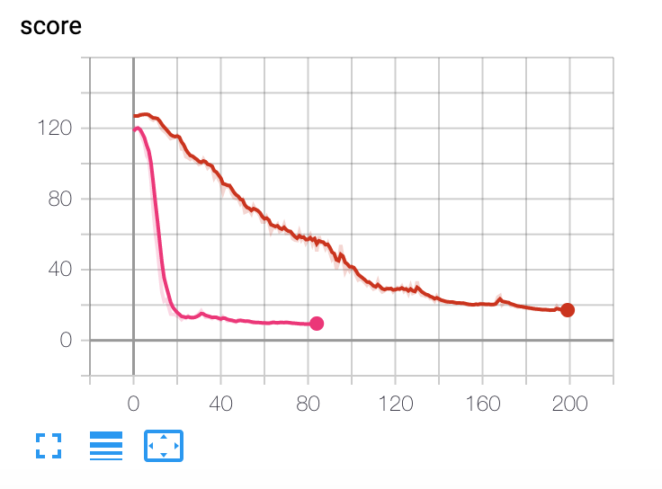

# Attack

## Requirements

- Python3
- Pytorch 1.0
- tqdm
- Numpy
- torchvision
- sklearn
- tensorboardX

## Models

- UNet
  
```
Original_Image -> UNet -> Noise
  
Noise + Original_Image -> Noise_Image  
  
Noise_Image -> Classifier -> out  
  
loss = CrossEntropyLoss(out, target_label)  
```

## Parameter

- beta   

  weight of loss min noise

## 目录结构
```
+-- models  
|   +-- tf_to_pytorch_inception_v1.pth  
|   +-- tf_to_pytorch_inception_v1.py  
|  
+-- dev_data  
|   +-- xxx.png  
|   +-- dev.csv  
|  
+-- data  
|   +-- IJCAI_2019_AAAC_train  
|      +-- 00000  
|         +-- xxx.jpg  
+-- dataset  
|   +-- image_from_json.py  
|   +-- image_list_folder.py  
+-- train.py  
+-- config.py  
+-- unet.py  
```
## Results

  
  